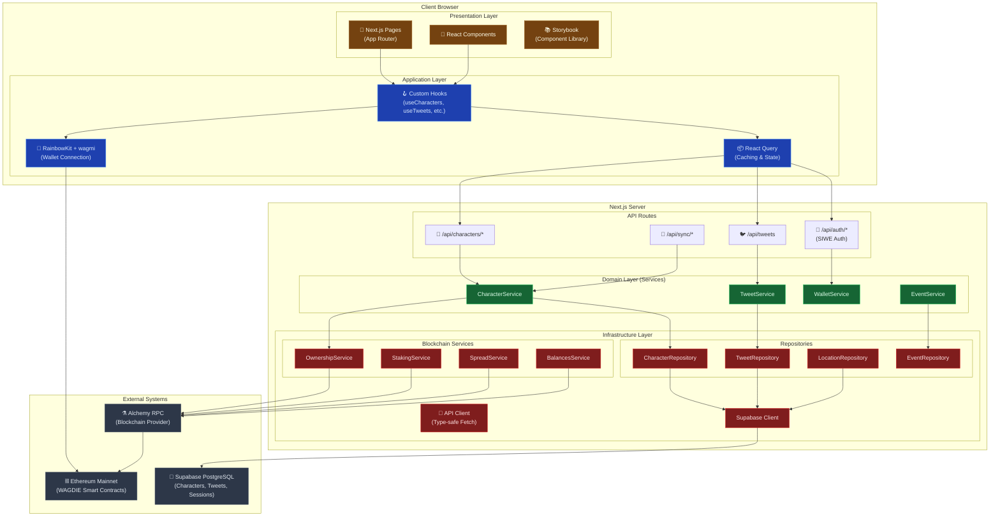
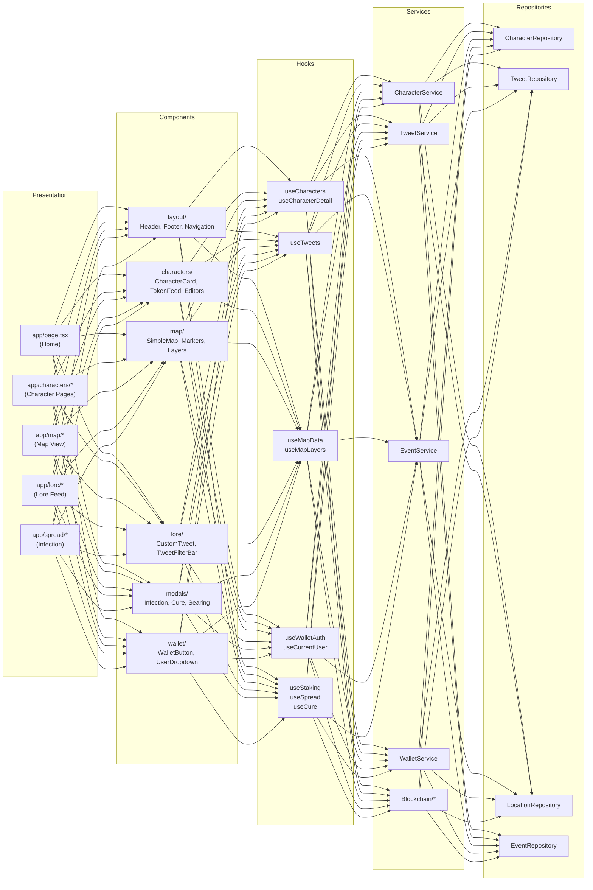
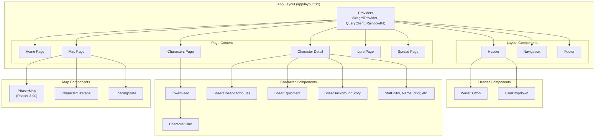
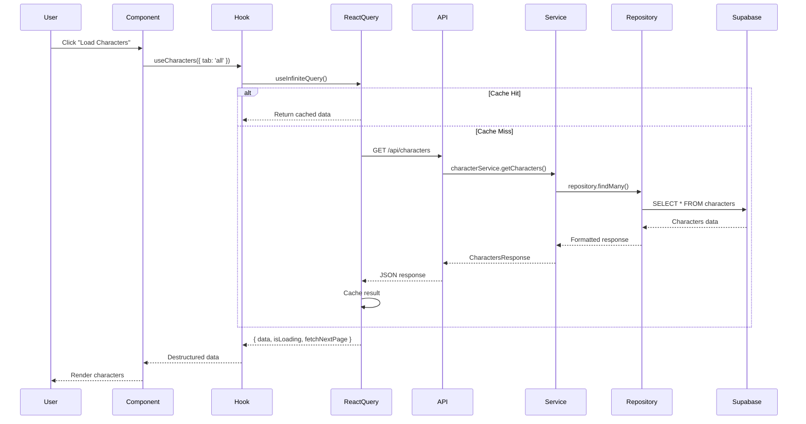
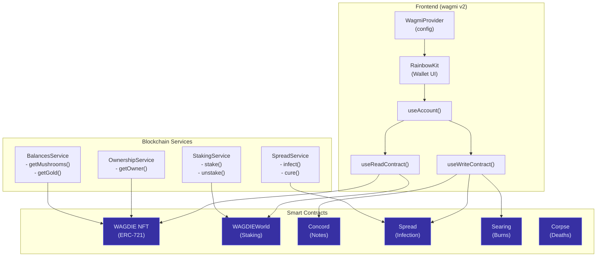
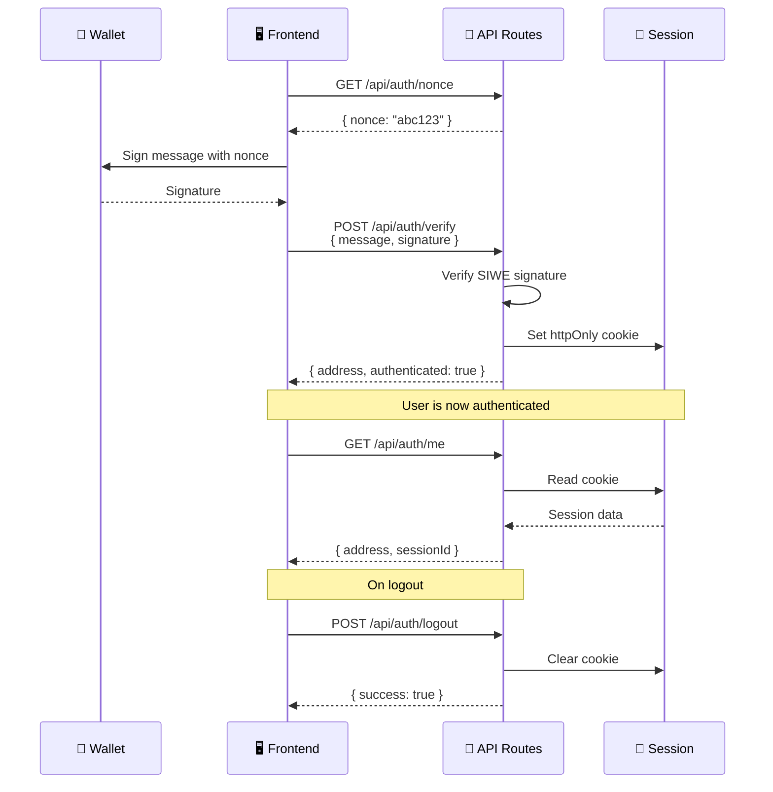

# WAGDIE Simplified - Architecture Diagram

## System Overview



## Layered Architecture Detail



## Component Hierarchy



## Data Flow



## Blockchain Integration



## Authentication Flow (SIWE)



## File Structure

```
wagdie-simplified/
├── 📁 app/                    # Next.js App Router (Presentation)
│   ├── 📁 api/               # API Routes
│   │   ├── auth/             # SIWE authentication
│   │   ├── characters/       # Character CRUD
│   │   ├── sync/             # Blockchain sync
│   │   └── tweets/           # Lore tweets
│   ├── characters/           # Character pages
│   ├── lore/                 # Lore feed
│   ├── map/                  # Interactive map
│   └── spread/               # Infection mechanics
│
├── 📁 components/             # React Components
│   ├── characters/           # Character UI
│   ├── home/                 # Homepage components
│   ├── layout/               # Header, Footer, Nav
│   ├── lore/                 # Tweet display
│   ├── map/                  # Map components
│   ├── modals/               # Modal dialogs
│   ├── shared/               # Reusable UI
│   ├── spread/               # Infection UI
│   ├── ui/                   # Base UI (Button, etc.)
│   └── wallet/               # Wallet connection
│
├── 📁 hooks/                  # Custom React Hooks
│   ├── map/                  # Map-specific hooks
│   ├── useAuth.ts            # Authentication
│   ├── useCharacters.ts      # Character data
│   ├── useTweets.ts          # Lore data
│   └── useWallet.ts          # Wallet state
│
├── 📁 lib/                    # Core Business Logic
│   ├── api/                  # API client
│   ├── auth/                 # SIWE utilities
│   ├── contracts/            # ABIs & addresses
│   ├── repositories/         # Data access
│   ├── services/             # Domain services
│   │   └── blockchain/       # Chain interactions
│   ├── store/                # State management
│   ├── types/                # TypeScript types
│   └── utils/                # Utility functions
│
├── 📁 types/                  # Global Type Definitions
│   ├── character.ts
│   ├── contracts.ts
│   ├── map.ts
│   └── wallet.ts
│
└── 📁 public/                 # Static Assets
    └── images/               # Map assets, icons
```

## Technology Stack

| Layer | Technology | Purpose |
|-------|------------|---------|
| **Framework** | Next.js 15 (App Router) | React framework with SSR |
| **UI** | React 18 + Tailwind CSS | Component library & styling |
| **State** | React Query (@tanstack) | Server state & caching |
| **Blockchain** | wagmi v2 + viem v2 | Ethereum interactions |
| **Wallet** | RainbowKit 2.2+ | Wallet connection UI |
| **Database** | Supabase PostgreSQL | Persistent storage |
| **Auth** | SIWE (Sign-In with Ethereum) | Web3 authentication |
| **Map** | Phaser 3.90 | Interactive game map |
| **Testing** | Jest + React Testing Library | Unit & integration tests |
| **Docs** | Storybook 8.x | Component documentation |

---

*Generated from codebase analysis on 2025-11-29*
