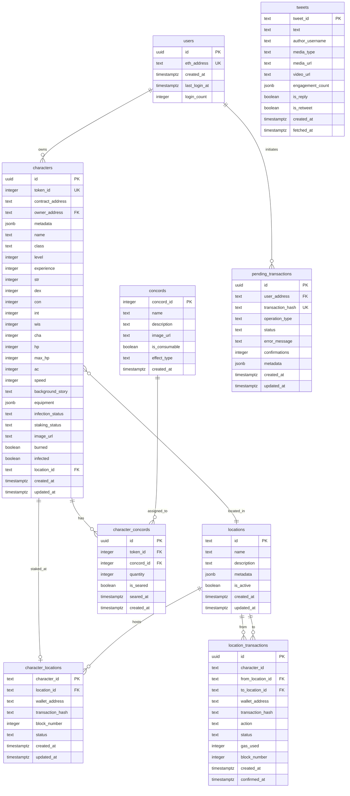

# WAGDIE Simplified Database Schema Documentation

> **Database**: Supabase PostgreSQL
> **Last Updated**: 2025-11-29
> **Version**: 2.0.0

## Table of Contents

1. [Overview](#overview)
2. [Entity-Relationship Diagram](#entity-relationship-diagram)
3. [Core Domain Tables](#core-domain-tables)
   - [users](#users)
   - [characters](#characters)
   - [locations](#locations)
   - [tweets](#tweets)
4. [Game Mechanics Tables](#game-mechanics-tables)
   - [concords](#concords)
   - [character_concords](#character_concords)
   - [character_locations](#character_locations)
   - [location_transactions](#location_transactions)
5. [Blockchain Integration Tables](#blockchain-integration-tables)
   - [pending_transactions](#pending_transactions)
6. [Data Import Tables](#data-import-tables)
   - [character_sheets](#character_sheets)
   - [metadata](#metadata)
   - [tokens](#tokens)
   - [login_records](#login_records)
   - [tweet_authors](#tweet_authors)
   - [migration_checkpoints](#migration_checkpoints)
7. [Relationships Summary](#relationships-summary)
8. [Indexes](#indexes)
9. [Row-Level Security Policies](#row-level-security-policies)
10. [Functions and Triggers](#functions-and-triggers)
11. [Enumerations and Constraints](#enumerations-and-constraints)

---

## Overview

The WAGDIE Simplified database supports a Web3 gaming platform with NFT character management, location-based staking mechanics, and social content integration. The schema is designed with:

- **Row-Level Security (RLS)** for fine-grained access control
- **Automatic timestamps** via triggers
- **JSONB fields** for flexible metadata storage
- **D&D 5e-style attributes** for character progression
- **Blockchain transaction tracking** for Web3 integration

### Key Domain Concepts

| Concept | Description |
|---------|-------------|
| **Characters** | WAGDIE NFTs with RPG attributes, staking status, and infection mechanics |
| **Locations** | Game world areas where characters can be staked |
| **Concords** | Special items/powers that characters can own and sear |
| **Tweets** | Social content from the official WAGDIE Twitter account |

---

## Entity-Relationship Diagram



---

## Core Domain Tables

### users

Stores user wallet addresses and login tracking for authentication.

| Column | Type | Nullable | Default | Description |
|--------|------|----------|---------|-------------|
| `id` | `UUID` | NO | `gen_random_uuid()` | Primary key |
| `eth_address` | `TEXT` | NO | - | Ethereum wallet address (unique, lowercase) |
| `created_at` | `TIMESTAMPTZ` | YES | `NOW()` | Account creation timestamp |
| `last_login_at` | `TIMESTAMPTZ` | YES | `NOW()` | Most recent login timestamp |
| `login_count` | `INTEGER` | YES | `1` | Total number of logins |

**Constraints:**
- `PRIMARY KEY (id)`
- `UNIQUE (eth_address)`

**Indexes:**
- `idx_users_eth_address` on `eth_address`

---

### characters

WAGDIE NFT characters with full RPG attributes and game state.

| Column | Type | Nullable | Default | Constraints | Description |
|--------|------|----------|---------|-------------|-------------|
| `id` | `UUID` | NO | `gen_random_uuid()` | PK | Primary key |
| `token_id` | `INTEGER` | NO | - | - | NFT token ID |
| `contract_address` | `TEXT` | NO | - | - | NFT contract address |
| `owner_address` | `TEXT` | YES | - | - | Current owner wallet |
| `metadata` | `JSONB` | YES | - | - | NFT metadata (name, image, traits) |
| `name` | `TEXT` | YES | - | - | Character display name |
| `class` | `TEXT` | YES | - | CHECK (Warrior/Mage/Rogue/Cleric) | Character class |
| `level` | `INTEGER` | YES | `1` | CHECK (1-20) | Character level |
| `experience` | `INTEGER` | YES | `0` | CHECK (>= 0) | Experience points |
| `str` | `INTEGER` | YES | `10` | CHECK (1-20) | Strength attribute |
| `dex` | `INTEGER` | YES | `10` | CHECK (1-20) | Dexterity attribute |
| `con` | `INTEGER` | YES | `10` | CHECK (1-20) | Constitution attribute |
| `int` | `INTEGER` | YES | `10` | CHECK (1-20) | Intelligence attribute |
| `wis` | `INTEGER` | YES | `10` | CHECK (1-20) | Wisdom attribute |
| `cha` | `INTEGER` | YES | `10` | CHECK (1-20) | Charisma attribute |
| `hp` | `INTEGER` | YES | `10` | CHECK (> 0, <= max_hp) | Current hit points |
| `max_hp` | `INTEGER` | YES | `10` | CHECK (> 0) | Maximum hit points |
| `ac` | `INTEGER` | YES | `10` | CHECK (10-25) | Armor class |
| `speed` | `INTEGER` | YES | `30` | CHECK (10-50) | Movement speed |
| `background_story` | `TEXT` | YES | - | - | Character backstory |
| `equipment` | `JSONB` | YES | - | - | Equipment (weapons, armor, items) |
| `location_id` | `TEXT` | YES | - | FK -> locations.id | Current staked location |
| `infection_status` | `TEXT` | YES | `'healthy'` | CHECK (healthy/infected/cured) | Infection game state |
| `staking_status` | `TEXT` | YES | `'unstaked'` | CHECK (unstaked/staked) | Staking game state |
| `image_url` | `TEXT` | YES | - | - | Character image URL |
| `burned` | `BOOLEAN` | YES | `FALSE` | - | Whether character is burned |
| `infected` | `BOOLEAN` | YES | `FALSE` | - | Legacy infection flag |
| `created_at` | `TIMESTAMPTZ` | YES | `NOW()` | - | Record creation time |
| `updated_at` | `TIMESTAMPTZ` | YES | `NOW()` | - | Last update time (auto-updated) |

**Constraints:**
- `PRIMARY KEY (id)`
- `UNIQUE (contract_address, token_id)`
- `characters_hp_check`: `hp <= max_hp`

**Indexes:**
- `idx_characters_token_id` on `token_id`
- `idx_characters_owner` on `owner_address`
- `idx_characters_burned` on `burned`
- `idx_characters_infected` on `infected`
- `idx_characters_location` on `location_id`
- `idx_characters_infection_status` on `infection_status`
- `idx_characters_staking_status` on `staking_status`
- `idx_characters_location_id` on `location_id`

**JSONB Schema - `metadata`:**
```typescript
interface CharacterMetadata {
  name?: string
  image?: string
  tokenId?: string
  description?: string
  level?: number
  hit_points?: number
  experience_points?: number
  origin?: string
  location?: string
  equipment?: {
    armor?: string
    back?: string
    mask?: string
  }
  attributes?: Array<{ trait_type: string; value: string | number }>
  background_story?: string
}
```

**JSONB Schema - `equipment`:**
```typescript
interface Equipment {
  weapons?: string[]
  armor?: string[]
  items?: string[]
  gold?: number
}
```

---

### locations

Game world locations where characters can be staked.

| Column | Type | Nullable | Default | Description |
|--------|------|----------|---------|-------------|
| `id` | `TEXT` | NO | - | Primary key (slug format, e.g., "concord_searing") |
| `name` | `TEXT` | NO | - | Display name |
| `description` | `TEXT` | YES | - | Lore description |
| `metadata` | `JSONB` | YES | - | Optional metadata (coordinates, rarity, properties) |
| `is_active` | `BOOLEAN` | YES | `TRUE` | Whether location is active in game |
| `created_at` | `TIMESTAMPTZ` | YES | `NOW()` | Record creation time |
| `updated_at` | `TIMESTAMPTZ` | YES | `NOW()` | Last update time |

**Constraints:**
- `PRIMARY KEY (id)`

**JSONB Schema - `metadata`:**
```typescript
interface LocationMetadata {
  coordinates?: { x: number; y: number }
  rarity?: 'common' | 'rare' | 'legendary'
  special_properties?: string[]
}
```

**Seed Data:**
| id | name | description |
|----|------|-------------|
| `the-ruins` | The Ruins | Ancient crumbling structures where shadows gather |
| `crossroads` | Crossroads | A meeting point for travelers and traders |
| `dark-forest` | Dark Forest | Dense woodland where danger lurks |
| `haven` | Haven | A safe refuge from the spreading darkness |
| `concord_searing` | Concord Searing | A place of power where ancient energies converge |
| `forsaken_lands` | Forsaken Lands | The starting grounds for all WAGDIE characters |

---

### tweets

Social media content from the official WAGDIE Twitter account.

| Column | Type | Nullable | Default | Constraints | Description |
|--------|------|----------|---------|-------------|-------------|
| `tweet_id` | `TEXT` | NO | - | PK | Twitter post ID |
| `text` | `TEXT` | NO | - | - | Tweet content |
| `author_username` | `TEXT` | NO | - | - | Twitter username |
| `media_type` | `TEXT` | YES | `'none'` | CHECK (none/image/video) | Media attachment type |
| `media_url` | `TEXT` | YES | - | - | Image URL if media_type is 'image' |
| `video_url` | `TEXT` | YES | - | - | Video URL if media_type is 'video' |
| `media_urls` | `TEXT[]` | YES | - | - | Legacy array of media URLs |
| `engagement_count` | `JSONB` | YES | - | - | Likes, retweets, replies counts |
| `is_reply` | `BOOLEAN` | YES | `FALSE` | - | Whether tweet is a reply |
| `is_retweet` | `BOOLEAN` | YES | `FALSE` | - | Whether tweet is a retweet |
| `created_at` | `TIMESTAMPTZ` | NO | - | - | Original tweet creation time |
| `fetched_at` | `TIMESTAMPTZ` | YES | `NOW()` | - | When tweet was fetched/stored |

**Constraints:**
- `PRIMARY KEY (tweet_id)`

**Indexes:**
- `idx_tweets_author` on `author_username`
- `idx_tweets_created_at` on `created_at DESC`
- `idx_tweets_media_type` on `media_type`

**JSONB Schema - `engagement_count`:**
```typescript
interface EngagementCount {
  likes: number
  retweets: number
  replies: number
}
```

---

## Game Mechanics Tables

### concords

Special items and powers that characters can own and use.

| Column | Type | Nullable | Default | Constraints | Description |
|--------|------|----------|---------|-------------|-------------|
| `concord_id` | `INTEGER` | NO | - | PK | Unique concord identifier |
| `name` | `TEXT` | NO | - | - | Display name |
| `description` | `TEXT` | NO | - | - | Description of the concord |
| `image_url` | `TEXT` | NO | - | - | Image asset URL |
| `is_consumable` | `BOOLEAN` | YES | `TRUE` | - | Whether used on consumption |
| `effect_type` | `TEXT` | NO | - | CHECK (stat_boost/ability/passive) | Type of effect |
| `created_at` | `TIMESTAMPTZ` | YES | `NOW()` | - | Record creation time |

**Constraints:**
- `PRIMARY KEY (concord_id)`

**Effect Types:**
| Type | Description |
|------|-------------|
| `stat_boost` | Temporarily increases character stats |
| `ability` | Grants a new ability or action |
| `passive` | Provides an ongoing passive effect |

**Seed Data:**
| concord_id | name | effect_type |
|------------|------|-------------|
| 15 | Strange Mushroom | ability |

---

### character_concords

Join table linking characters to their owned concords.

| Column | Type | Nullable | Default | Constraints | Description |
|--------|------|----------|---------|-------------|-------------|
| `id` | `UUID` | NO | `gen_random_uuid()` | PK | Primary key |
| `token_id` | `INTEGER` | NO | - | FK | Character token ID |
| `concord_id` | `INTEGER` | NO | - | FK -> concords.concord_id | Concord being owned |
| `quantity` | `INTEGER` | NO | `1` | CHECK (>= 1) | Number owned |
| `is_seared` | `BOOLEAN` | YES | `FALSE` | - | Whether concord has been seared |
| `seared_at` | `TIMESTAMPTZ` | YES | - | - | When searing occurred |
| `created_at` | `TIMESTAMPTZ` | YES | `NOW()` | - | Record creation time |

**Constraints:**
- `PRIMARY KEY (id)`
- `UNIQUE (token_id, concord_id)`
- `FOREIGN KEY (concord_id) REFERENCES concords(concord_id)`

**Indexes:**
- `idx_character_concords_token_id` on `token_id`

---

### character_locations

Denormalized table tracking character staking locations for performance.

| Column | Type | Nullable | Default | Constraints | Description |
|--------|------|----------|---------|-------------|-------------|
| `character_id` | `TEXT` | NO | - | PK | WAGDIE token ID |
| `location_id` | `TEXT` | NO | - | FK -> locations.id | Staked location |
| `wallet_address` | `TEXT` | NO | - | - | Owner wallet address |
| `transaction_hash` | `TEXT` | NO | - | - | Latest blockchain transaction |
| `block_number` | `INTEGER` | YES | - | - | Block where location was set |
| `status` | `TEXT` | NO | - | CHECK (staked/unstaked/pending) | Current status |
| `created_at` | `TIMESTAMPTZ` | NO | `NOW()` | - | When first staked |
| `updated_at` | `TIMESTAMPTZ` | NO | `NOW()` | - | Last movement time |

**Constraints:**
- `PRIMARY KEY (character_id)`
- `FOREIGN KEY (location_id) REFERENCES locations(id)`

**Indexes:**
- `idx_character_locations_wallet` on `wallet_address`
- `idx_character_locations_location` on `location_id`
- `idx_character_locations_status` on `status`

**Status Values:**
| Status | Description |
|--------|-------------|
| `staked` | Character is actively staked at location |
| `unstaked` | Character is not staked |
| `pending` | Transaction is in progress |

---

### location_transactions

Audit log of all character movements between locations.

| Column | Type | Nullable | Default | Constraints | Description |
|--------|------|----------|---------|-------------|-------------|
| `id` | `UUID` | NO | `gen_random_uuid()` | PK | Primary key |
| `character_id` | `TEXT` | NO | - | - | WAGDIE token ID |
| `from_location_id` | `TEXT` | YES | - | FK -> locations.id | Previous location (null if initial stake) |
| `to_location_id` | `TEXT` | NO | - | FK -> locations.id | New location |
| `wallet_address` | `TEXT` | NO | - | - | User who performed action |
| `transaction_hash` | `TEXT` | NO | - | - | Blockchain transaction hash |
| `action` | `TEXT` | NO | - | CHECK (stake/move/unstake) | Action type |
| `status` | `TEXT` | NO | - | CHECK (pending/confirmed/failed) | Transaction status |
| `gas_used` | `INTEGER` | YES | - | - | Gas consumed |
| `block_number` | `INTEGER` | YES | - | - | Confirmation block number |
| `created_at` | `TIMESTAMPTZ` | NO | `NOW()` | - | When record created |
| `confirmed_at` | `TIMESTAMPTZ` | YES | - | - | When transaction confirmed |

**Constraints:**
- `PRIMARY KEY (id)`
- `FOREIGN KEY (from_location_id) REFERENCES locations(id)`
- `FOREIGN KEY (to_location_id) REFERENCES locations(id)`

**Indexes:**
- `idx_location_transactions_character` on `character_id`
- `idx_location_transactions_hash` on `transaction_hash`
- `idx_location_transactions_created` on `created_at DESC`
- `idx_location_transactions_status` on `status`

**Action Values:**
| Action | Description |
|--------|-------------|
| `stake` | Initial staking of character to a location |
| `move` | Moving character between locations |
| `unstake` | Removing character from staking |

---

## Blockchain Integration Tables

### pending_transactions

Tracks user-initiated blockchain transactions through their lifecycle.

| Column | Type | Nullable | Default | Constraints | Description |
|--------|------|----------|---------|-------------|-------------|
| `id` | `UUID` | NO | `uuid_generate_v4()` | PK | Primary key |
| `user_address` | `TEXT` | NO | - | - | Ethereum address (lowercase) |
| `transaction_hash` | `TEXT` | YES | - | UK | Blockchain transaction hash |
| `operation_type` | `TEXT` | NO | - | - | Type of operation (e.g., sear_concords, stake_wagdies) |
| `status` | `TEXT` | NO | `'pending'` | CHECK | Transaction status |
| `error_message` | `TEXT` | YES | - | - | Error details if failed |
| `confirmations` | `INTEGER` | YES | `0` | - | Number of block confirmations |
| `metadata` | `JSONB` | YES | `'{}'` | - | Operation-specific data |
| `created_at` | `TIMESTAMPTZ` | YES | `NOW()` | - | Transaction initiation time |
| `updated_at` | `TIMESTAMPTZ` | YES | `NOW()` | - | Last status update |

**Constraints:**
- `PRIMARY KEY (id)`
- `UNIQUE (transaction_hash)`
- `CHECK (status IN ('idle', 'pending', 'confirming', 'success', 'error'))`

**Indexes:**
- `idx_pending_transactions_user_address` on `user_address`
- `idx_pending_transactions_transaction_hash` on `transaction_hash`
- `idx_pending_transactions_status` on `status`
- `idx_pending_transactions_created_at` on `created_at DESC`

**Status Values:**
| Status | Description |
|--------|-------------|
| `idle` | Transaction not yet submitted |
| `pending` | Waiting for blockchain submission |
| `confirming` | Submitted, awaiting confirmations |
| `success` | Successfully confirmed |
| `error` | Transaction failed |

---

## Data Import Tables

These tables support the migration of legacy WAGDIE data from Firebase/JSON sources.

### character_sheets

RPG character data with full D&D-style attributes and equipment.

| Column | Type | Nullable | Default | Description |
|--------|------|----------|---------|-------------|
| `id` | `UUID` | NO | `gen_random_uuid()` | Primary key |
| `token_id` | `INTEGER` | NO | - | NFT token ID (unique) |
| `name` | `VARCHAR(255)` | NO | - | Character name |
| `level` | `INTEGER` | YES | `1` | Character level |
| `origin` | `VARCHAR(255)` | YES | - | Character origin/background |
| `location` | `VARCHAR(255)` | YES | `'Unknown'` | Current location name |
| `hit_points` | `INTEGER` | NO | `0` | Current HP |
| `experience_points` | `INTEGER` | YES | `0` | Total XP |
| `equipment` | `JSONB` | NO | `'{}'` | Equipment (armor, back, mask) |
| `attributes` | `JSONB` | NO | `'{}'` | Stats (STR, DEX, CON, etc.) |
| `background_story` | `TEXT` | YES | - | Character backstory |
| `created_at` | `TIMESTAMPTZ` | YES | `NOW()` | Record creation |
| `updated_at` | `TIMESTAMPTZ` | YES | `NOW()` | Last update |

**Constraints:**
- `PRIMARY KEY (id)`
- `UNIQUE (token_id)`

**Indexes:**
- `idx_character_sheets_token_id` on `token_id`
- `idx_character_sheets_name` on `name`

---

### metadata

NFT metadata including traits and image URLs.

| Column | Type | Nullable | Default | Description |
|--------|------|----------|---------|-------------|
| `id` | `UUID` | NO | `gen_random_uuid()` | Primary key |
| `token_id` | `INTEGER` | NO | - | NFT token ID (unique) |
| `name` | `VARCHAR(255)` | YES | - | NFT name |
| `description` | `TEXT` | YES | - | NFT description |
| `image_url` | `TEXT` | YES | - | IPFS or HTTP image URL |
| `attributes` | `JSONB` | YES | - | NFT traits and properties |
| `created_at` | `TIMESTAMPTZ` | YES | `NOW()` | Record creation |
| `updated_at` | `TIMESTAMPTZ` | YES | `NOW()` | Last update |

**Constraints:**
- `PRIMARY KEY (id)`
- `UNIQUE (token_id)`

**Indexes:**
- `idx_metadata_token_id` on `token_id`
- `idx_metadata_name` on `name`

---

### tokens

NFT ownership tracking with relationships to character sheets and metadata.

| Column | Type | Nullable | Default | Description |
|--------|------|----------|---------|-------------|
| `id` | `UUID` | NO | `gen_random_uuid()` | Primary key |
| `token_id` | `INTEGER` | NO | - | NFT token ID (unique) |
| `owner_address` | `VARCHAR(255)` | YES | - | Current owner wallet |
| `character_sheet_id` | `UUID` | YES | - | FK to character_sheets |
| `metadata_id` | `UUID` | YES | - | FK to metadata |
| `created_at` | `TIMESTAMPTZ` | YES | `NOW()` | Record creation |
| `updated_at` | `TIMESTAMPTZ` | YES | `NOW()` | Last update |

**Constraints:**
- `PRIMARY KEY (id)`
- `UNIQUE (token_id)`
- `FOREIGN KEY (character_sheet_id) REFERENCES character_sheets(id)`
- `FOREIGN KEY (metadata_id) REFERENCES metadata(id)`

**Indexes:**
- `idx_tokens_token_id` on `token_id`
- `idx_tokens_owner` on `owner_address`
- `idx_tokens_character_sheet` on `character_sheet_id`
- `idx_tokens_metadata` on `metadata_id`

---

### login_records

User wallet login tracking and statistics.

| Column | Type | Nullable | Default | Description |
|--------|------|----------|---------|-------------|
| `id` | `UUID` | NO | `gen_random_uuid()` | Primary key |
| `user_address` | `VARCHAR(255)` | NO | - | Wallet address (unique) |
| `last_login` | `TIMESTAMPTZ` | YES | - | Most recent login |
| `login_count` | `INTEGER` | YES | `0` | Total login count |
| `created_at` | `TIMESTAMPTZ` | YES | `NOW()` | Record creation |
| `updated_at` | `TIMESTAMPTZ` | YES | `NOW()` | Last update |

**Constraints:**
- `PRIMARY KEY (id)`
- `UNIQUE (user_address)`

**Indexes:**
- `idx_login_records_address` on `user_address`

---

### tweet_authors

Twitter/X author information and profiles.

| Column | Type | Nullable | Default | Description |
|--------|------|----------|---------|-------------|
| `id` | `UUID` | NO | `gen_random_uuid()` | Primary key |
| `username` | `VARCHAR(255)` | NO | - | Twitter username (unique) |
| `display_name` | `VARCHAR(255)` | YES | - | Display name |
| `profile_image` | `TEXT` | YES | - | Profile image URL |
| `created_at` | `TIMESTAMPTZ` | YES | `NOW()` | Record creation |
| `updated_at` | `TIMESTAMPTZ` | YES | `NOW()` | Last update |

**Constraints:**
- `PRIMARY KEY (id)`
- `UNIQUE (username)`

**Indexes:**
- `idx_tweet_authors_username` on `username`

---

### migration_checkpoints

Tracks migration progress for resumable batch operations.

| Column | Type | Nullable | Default | Constraints | Description |
|--------|------|----------|---------|-------------|-------------|
| `id` | `UUID` | NO | `gen_random_uuid()` | PK | Primary key |
| `migration_id` | `VARCHAR(255)` | NO | - | - | Unique migration identifier |
| `entity_name` | `VARCHAR(255)` | NO | - | - | Entity being migrated |
| `last_processed_index` | `INTEGER` | NO | `0` | - | Last processed record index |
| `total_records` | `INTEGER` | NO | `0` | - | Total records to process |
| `batch_id` | `VARCHAR(255)` | YES | - | - | Current batch identifier |
| `status` | `VARCHAR(50)` | NO | `'in_progress'` | CHECK | Migration status |
| `created_at` | `TIMESTAMPTZ` | YES | `NOW()` | - | Migration start time |
| `completed_at` | `TIMESTAMPTZ` | YES | - | - | Migration completion time |

**Constraints:**
- `PRIMARY KEY (id)`
- `CHECK (status IN ('in_progress', 'completed', 'failed'))`

**Indexes:**
- `idx_migration_checkpoints_migration` on `migration_id`
- `idx_migration_checkpoints_entity` on `entity_name`

---

## Relationships Summary

```
users (1) ----< (N) characters      [via owner_address = eth_address]
users (1) ----< (N) pending_transactions [via user_address = eth_address]

characters (1) ----< (N) character_concords [via token_id]
characters (N) >---- (1) locations         [via location_id]

concords (1) ----< (N) character_concords [via concord_id]

locations (1) ----< (N) character_locations   [via location_id]
locations (1) ----< (N) location_transactions [via from_location_id, to_location_id]

tokens (N) >---- (1) character_sheets [via character_sheet_id]
tokens (N) >---- (1) metadata         [via metadata_id]

tweets (N) >---- (1) tweet_authors    [via tweet_author_id]
```

### Cardinality Reference

| Relationship | Type | Description |
|--------------|------|-------------|
| User -> Characters | One-to-Many | A user can own multiple characters |
| User -> Pending Transactions | One-to-Many | A user can have multiple transactions |
| Character -> Concords | Many-to-Many | Characters can own multiple concords via join table |
| Character -> Location | Many-to-One | Multiple characters can be at one location |
| Location -> Transactions | One-to-Many | A location can have many transaction records |
| Token -> Character Sheet | Many-to-One | Tokens link to character data |
| Token -> Metadata | Many-to-One | Tokens link to NFT metadata |

---

## Indexes

### Performance Indexes Summary

| Table | Index Name | Columns | Purpose |
|-------|------------|---------|---------|
| `users` | `idx_users_eth_address` | `eth_address` | Fast wallet lookups |
| `characters` | `idx_characters_token_id` | `token_id` | NFT ID queries |
| `characters` | `idx_characters_owner` | `owner_address` | Owner filtering |
| `characters` | `idx_characters_burned` | `burned` | Filter burned chars |
| `characters` | `idx_characters_infection_status` | `infection_status` | Game state queries |
| `characters` | `idx_characters_staking_status` | `staking_status` | Staking queries |
| `tweets` | `idx_tweets_created_at` | `created_at DESC` | Timeline queries |
| `tweets` | `idx_tweets_media_type` | `media_type` | Media filtering |
| `character_locations` | `idx_character_locations_wallet` | `wallet_address` | Wallet filtering |
| `character_locations` | `idx_character_locations_location` | `location_id` | Location grouping |
| `location_transactions` | `idx_location_transactions_created` | `created_at DESC` | Audit timeline |
| `pending_transactions` | `idx_pending_transactions_status` | `status` | Status filtering |

---

## Row-Level Security Policies

All tables have RLS enabled with the following policy patterns:

### Public Read Access
Most tables allow anonymous read access for game data:

```sql
CREATE POLICY "Allow public read access on [table]"
  ON [table] FOR SELECT
  USING (true);
```

### User-Specific Write Access
Users can only modify their own data:

```sql
CREATE POLICY "Users can update own record"
  ON users FOR UPDATE
  USING (eth_address = current_setting('request.jwt.claims', true)::json->>'eth_address');
```

### Service Role Management
Administrative operations require service role:

```sql
CREATE POLICY "Service role can manage [table]"
  ON [table] FOR ALL
  USING (auth.role() = 'service_role');
```

### Policy Matrix

| Table | SELECT | INSERT | UPDATE | DELETE |
|-------|--------|--------|--------|--------|
| `users` | Public | Public | Owner only | - |
| `characters` | Public | Service | Service | Service |
| `locations` | Public | Service | Service | Service |
| `tweets` | Public | Service | Service | Service |
| `concords` | Public | Service | Service | Service |
| `character_concords` | Public | Service | Service | Service |
| `pending_transactions` | Owner | Owner | Owner | Owner |

---

## Functions and Triggers

### update_updated_at_column()

Automatically updates the `updated_at` timestamp on row modifications.

```sql
CREATE OR REPLACE FUNCTION update_updated_at_column()
RETURNS TRIGGER AS $$
BEGIN
  NEW.updated_at = NOW();
  RETURN NEW;
END;
$$ language 'plpgsql';
```

### Triggers Using This Function

| Table | Trigger Name |
|-------|--------------|
| `characters` | `update_characters_updated_at` |
| `locations` | `update_locations_updated_at` |
| `character_locations` | `update_character_locations_updated_at` |
| `pending_transactions` | `update_pending_transactions_updated_at` |
| `character_sheets` | `update_character_sheets_updated_at` |
| `login_records` | `update_login_records_updated_at` |
| `metadata` | `update_metadata_updated_at` |
| `tokens` | `update_tokens_updated_at` |
| `tweets` | `update_tweets_updated_at` |
| `tweet_authors` | `update_tweet_authors_updated_at` |

---

## Enumerations and Constraints

### Character Class
```sql
CHECK (class IN ('Warrior', 'Mage', 'Rogue', 'Cleric'))
```

### Infection Status
```sql
CHECK (infection_status IN ('healthy', 'infected', 'cured'))
```

### Staking Status
```sql
CHECK (staking_status IN ('unstaked', 'staked'))
```

### Transaction Status
```sql
CHECK (status IN ('idle', 'pending', 'confirming', 'success', 'error'))
```

### Location Transaction Status
```sql
CHECK (status IN ('pending', 'confirmed', 'failed'))
```

### Character Location Status
```sql
CHECK (status IN ('staked', 'unstaked', 'pending'))
```

### Location Transaction Action
```sql
CHECK (action IN ('stake', 'move', 'unstake'))
```

### Media Type
```sql
CHECK (media_type IN ('none', 'image', 'video'))
```

### Concord Effect Type
```sql
CHECK (effect_type IN ('stat_boost', 'ability', 'passive'))
```

### D&D Attribute Ranges
```sql
CHECK (str BETWEEN 1 AND 20)
CHECK (dex BETWEEN 1 AND 20)
CHECK (con BETWEEN 1 AND 20)
CHECK (int BETWEEN 1 AND 20)
CHECK (wis BETWEEN 1 AND 20)
CHECK (cha BETWEEN 1 AND 20)
CHECK (level BETWEEN 1 AND 20)
CHECK (ac BETWEEN 10 AND 25)
CHECK (speed BETWEEN 10 AND 50)
CHECK (hp > 0)
CHECK (max_hp > 0)
CHECK (hp <= max_hp)
CHECK (experience >= 0)
```

---

## Migration History

| Migration | Date | Description |
|-----------|------|-------------|
| `20250101000000_initial_schema.sql` | 2025-01-01 | Core tables: users, characters, tweets, locations |
| `20251028000000_page_wireframes_schema.sql` | 2025-10-28 | Concords, D&D attributes, enhanced tweets |
| `20251029000000_blockchain_integration.sql` | 2025-10-29 | Pending transactions tracking |
| `20251103000000_add_map_tables.sql` | 2025-11-03 | Character locations, location transactions |
| `20251104194746_add_foreign_keys.sql` | 2025-11-04 | Foreign key constraints |
| `20251119000000_database_restoration_schema.sql` | 2025-11-19 | Data import tables for migration |
| `20251125000000_import_wagdie_data.sql` | 2025-11-25 | WAGDIE character data import |

---

## Quick Reference

### Common Queries

**Get all characters owned by a wallet:**
```sql
SELECT * FROM characters
WHERE owner_address = '0x...'
ORDER BY token_id;
```

**Get characters at a location:**
```sql
SELECT c.* FROM characters c
JOIN character_locations cl ON c.token_id::text = cl.character_id
WHERE cl.location_id = 'concord_searing' AND cl.status = 'staked';
```

**Get character with concords:**
```sql
SELECT c.*, co.name as concord_name, cc.quantity
FROM characters c
JOIN character_concords cc ON c.token_id = cc.token_id
JOIN concords co ON cc.concord_id = co.concord_id
WHERE c.token_id = 1234;
```

**Get recent location transactions:**
```sql
SELECT lt.*, l.name as location_name
FROM location_transactions lt
JOIN locations l ON lt.to_location_id = l.id
WHERE lt.wallet_address = '0x...'
ORDER BY lt.created_at DESC
LIMIT 10;
```

---

*Documentation generated from Supabase migrations and TypeScript type definitions.*
